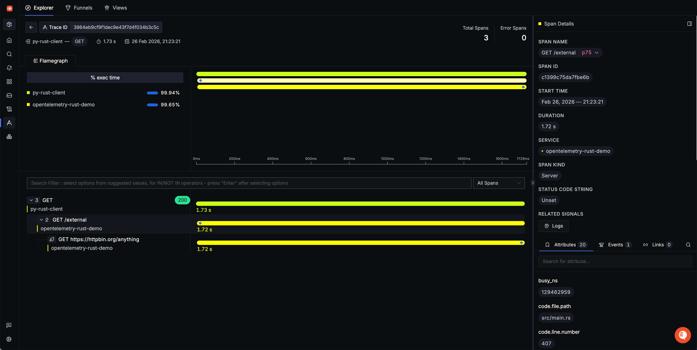

# OpenTelemetry Rust Demo

## Prerequisites

- Rust toolchain installed (`cargo --version`)
- A SigNoz Cloud account, to visualize telemetry
- [`uv`](https://docs.astral.sh/uv/getting-started/installation/#installation-methods) (for distributed tracing endpoint)

## Get your SigNoz values

You need two values from SigNoz Cloud:

- **Ingestion key**: from your SigNoz Cloud ingestion keys page
- **Region endpoint**: from your SigNoz Cloud region docs (for example `ingest.us.signoz.cloud`)

Use them in this format:

- Endpoint: `https://ingest.<region>.signoz.cloud:443`
- Header value: your ingestion key string

## Run the app

```bash
OTEL_EXPORTER_OTLP_ENDPOINT="https://ingest.<region>.signoz.cloud:443" \
SIGNOZ_INGESTION_KEY="<your-signoz-key>" \
OTEL_RESOURCE_ATTRIBUTES="service.name=opentelemetry-rust-demo,service.version=0.1.0,deployment.environment=dev" \
cargo run
```

The server listens on `127.0.0.1:8085`.

## Generate load

In a separate terminal, run:

```bash
chmod +x load_gen.sh
./load_gen.sh
```

This sends repeated requests to the demo endpoints so you can quickly see traces, logs, and metrics in SigNoz.

## Simulate a second service with Python (uv)

> First, ensure you have [`uv` installed](https://docs.astral.sh/uv/getting-started/installation/#installation-methods).

To emulate a distributed trace across services, run the included Python client at `scripts/python_client.py` (it repeatedly calls `/external`).

Run it with `uv` and OpenTelemetry auto-instrumentation:

```bash
OTEL_SERVICE_NAME="py-rust-client" \
OTEL_EXPORTER_OTLP_ENDPOINT="https://ingest.<region>.signoz.cloud:443" \
OTEL_EXPORTER_OTLP_HEADERS="signoz-ingestion-key=<your-signoz-key>" \
uv run \
  --with opentelemetry-distro \
  --with opentelemetry-exporter-otlp \
  --with opentelemetry-instrumentation-requests \
  opentelemetry-instrument python scripts/python_client.py
```

The script will prompt you for the number of times you wish to call the `/external` endpoint.
Enter a positive number like 5.

This should produce a trace chain like:

- Python client span (`GET /external`)
- Rust server span (`GET /external`)
- Rust outbound span (`GET https://httpbin.org/anything`)

